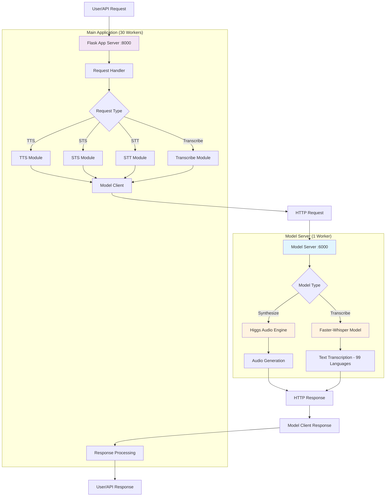

# LixAudio Smart Router for Natural Synthetic Voice Synthesis


---

## Overview

LixAudio Smart Router for Natural Synthetic Voice Synthesis is a modular Python framework for advanced audio processing, speech-to-text (STT), text-to-speech (TTS), and semantic audio understanding. It integrates state-of-the-art models and tools for building, serving, and experimenting with multimodal audio applications.

---

## Features

- **Speech Recognition (STT):** Accurate transcription of audio to text using Faster-Whisper (99 language support).
- **Speech Synthesis (TTS):** Natural-sounding voice generation from text.
- **Speech-to-Speech (STS):** Transform and resynthesis of speech with voice cloning.
- **Semantic Audio Processing:** Deep understanding and manipulation of audio content.
- **Modular Architecture:** Easily extend or swap components.
- **Distributed Model Server:** Dedicated model server for efficient resource management.
- **Server & API:** Ready-to-use server for deploying audio services.
- **Utilities & Tools:** Helpers for configuration, intent detection, and more.

---

## System Architecture



## Docker Structure

The project includes a Dockerfile for easy deployment and reproducibility. The Docker setup:

- **Base Image:** Uses `python:3.12-bullseye` for a stable Python environment.
- **System Dependencies:** Installs essential build tools and `ffmpeg` for audio processing.
- **Python Dependencies:** Installs all required Python packages from `requirements.txt`, including Faster-Whisper for optimized transcription.
- **Source Code:** Copies the entire project into the container.
- **Dual Service Architecture:** 
  - **Model Server (Port 6000):** Single worker handling model inference
  - **Flask App (Port 8000):** 30 workers handling API requests
- **Resource Optimization:** Models loaded once in dedicated server, preventing memory duplication across workers. Faster-Whisper provides optimized inference on CUDA.

This structure ensures efficient resource utilization with models loaded once while maintaining high concurrency for API requests. Faster-Whisper provides faster transcription inference compared to standard Whisper.

---
## API Endpoints

### Main Application Server (Port 8000)

### `/generate` Endpoint

#### `POST /generate`

Advanced endpoint for audio generation with support for voice selection, voice cloning, and speech input processing.

**Request Body (JSON):**

```json
{
    "messages": [
        {
            "role": "system",
            "voice": "alloy" or "<base64_audio_string>",
            "content": [
                { "type": "text", "text": "System instructions here" }
            ]
        },
        {
            "role": "user",
            "content": [
                { "type": "text", "text": "Your prompt text here" },
                {
                    "type": "speech_audio",
                    "audio": { "data": "<base64_audio_string>", "format": "wav" }
                }
            ]
        }
    ],
    "seed": 42
}
```

**Parameters:**

- **`messages`** (array, required): Array of message objects
  - **`system` message** (object):
    - **`voice`** (string, optional): Voice to use for synthesis
      - Predefined voice names: `alloy`, `amuch`, `ash`, `ballad`, `coral`, `dan`, `echo`, `fable`, `nova`, `onyx`, `sage`, `shimmer`, `verse`, `ghost`
      - Or provide a base64-encoded WAV audio string for voice cloning
        - **Minimum duration:** 5 seconds
        - **Maximum duration:** 8 seconds (audio will be trimmed if longer)
    - **`content`** (array): Message content with text instructions
      - `type: "text"`: System instructions for the audio generation

  - **`user` message** (object, required):
    - **`content`** (array): User input content
      - `type: "text"`: The prompt text to be spoken (required)
      - `type: "speech_audio"`: Optional speech input for STS (Speech-to-Speech)
        - **Maximum duration:** 2 minutes (120 seconds)

- **`seed`** (integer, optional): Random seed for reproducibility. Default: `42`

**Voice Cloning:**
- If the `voice` field contains a predefined voice name, that voice will be used directly
- If the `voice` field contains a base64-encoded audio string:
  - The audio will be validated and must be **at least 5 seconds long**
  - Only the first **8 seconds** of audio will be used for cloning
  - Returns a `400` error if audio is less than 5 seconds

**Speech Input (STS):**
- Include a `speech_audio` object in user content to enable Speech-to-Speech functionality
- Maximum audio duration is **2 minutes (120 seconds)**
- Audio will be transcribed and processed through the audio pipeline

**Response:**

The response can be:
- **Audio WAV file**: For successful audio synthesis (with `audio/wav` MIME type)
- **JSON object**: For text results or error responses
  - Success: Contains `id`, `object`, `choices` with message content
  - Error: Contains error message with code

**Example 1: Using a predefined voice**

```bash
curl -X POST http://localhost:8000/generate \
    -H "Content-Type: application/json" \
    -d '{
        "messages": [
            {
                "role": "system",
                "voice": "alloy",
                "content": [
                    { "type": "text", "text": "You are a helpful assistant. Respond naturally." }
                ]
            },
            {
                "role": "user",
                "content": [
                    { "type": "text", "text": "Generate a story about a robot." }
                ]
            }
        ],
        "seed": 42
    }' --output output.wav
```

**Example 2: Using voice cloning with custom audio (base64)**

```bash
curl -X POST http://localhost:8000/generate \
    -H "Content-Type: application/json" \
    -d '{
        "messages": [
            {
                "role": "system",
                "voice": "<base64_encoded_audio_6_seconds>",
                "content": [
                    { "type": "text", "text": "Clone this voice and maintain the same tone." }
                ]
            },
            {
                "role": "user",
                "content": [
                    { "type": "text", "text": "Tell me a joke." }
                ]
            }
        ],
        "seed": 42
    }' --output output.wav
```

**Example 3: Using Speech-to-Speech (STS)**

```bash
curl -X POST http://localhost:8000/generate \
    -H "Content-Type: application/json" \
    -d '{
        "messages": [
            {
                "role": "system",
                "voice": "ballad",
                "content": [
                    { "type": "text", "text": "Transform speech with emotion and clarity." }
                ]
            },
            {
                "role": "user",
                "content": [
                    { "type": "text", "text": "Generate audio response." },
                    {
                        "type": "speech_audio",
                        "audio": { "data": "<base64_encoded_audio_max_2_minutes>" }
                    }
                ]
            }
        ],
        "seed": 42
    }' --output output.wav
```

**Error Handling:**

- **400 Bad Request**: Missing required fields, invalid voice duration, or malformed audio
- **500 Internal Server Error**: Processing error during audio generation

### Model Server (Port 6000)

The model server provides internal API endpoints for model inference:

#### `GET /health`
Health check endpoint for monitoring model server status.

#### `POST /synthesize`
Internal endpoint for audio synthesis using Higgs Audio Engine.

#### `POST /transcribe`
Internal endpoint for audio transcription using Whisper model.

**Modality Types:**
- **TTS:** Text-to-Speech (audio output)
- **STS:** Speech-to-Speech (audio output)
- **STT:** Speech-to-Text (text output)
- **TTT:** Text-to-Text (text output)

**Architecture Benefits:**
- **Resource Efficiency:** Models loaded once, preventing memory duplication across workers
- **High Concurrency:** 30 Flask workers handle API requests while 1 model server manages inference
- **Fault Isolation:** Model server failures don't crash the main application
- **Scalability:** Independent scaling of API and model servers

---

## Transcription Model: Faster-Whisper

LixAudio Smart Router for Natural Synthetic Voice Synthesis uses **Faster-Whisper**, an optimized implementation of OpenAI's Whisper model, for speech-to-text transcription.

### Supported Languages

Faster-Whisper supports **99 languages** for automatic speech recognition, including:

**Major Languages:** English, Spanish, French, German, Italian, Portuguese, Dutch, Russian, Chinese (Simplified & Traditional), Japanese, Korean, Arabic, Hindi, Turkish, Vietnamese, Thai, Polish, Indonesian, and more.

The model automatically detects the language of the input audio during transcription, eliminating the need for explicit language selection in most cases.

### Performance Characteristics

- **Inference Device:** CUDA-enabled GPU (with CPU fallback)
- **Compute Type:** INT8 + Float32 optimization for faster inference
- **VAD (Voice Activity Detection):** Enabled to skip silent segments
- **Max Input Duration:** 1.5 minutes (90 seconds)
- **Output:** Accurate transcription with automatic language detection

---

## Available Voices

The following predefined voices are available for audio synthesis:

- `alloy` - Balanced, neutral tone
- `amuch` - Warm, friendly voice
- `ash` - Cool, clear voice
- `ballad` - Narrative-style voice
- `coral` - Bright, energetic voice
- `dan` - Deep, authoritative voice
- `echo` - Resonant, echo-like quality
- `fable` - Storytelling voice
- `nova` - Modern, contemporary voice
- `onyx` - Dark, sophisticated voice
- `sage` - Wise, contemplative voice
- `shimmer` - Bright, shimmering quality
- `verse` - Poetic, rhythmic voice
- `ghost` - Ethereal, atmospheric voice

---

## Constraints & Limits

| Feature | Constraint | Details |
|---------|-----------|---------|
| Voice Cloning Audio | Minimum 5 seconds | Voice reference audio must be at least 5 seconds |
| Voice Cloning Audio | Maximum 8 seconds | Only first 8 seconds of custom voice audio used |
| Speech Input (STS) | Maximum 1.5 minutes | Speech audio input limited to 90 seconds |
| Text Synthesis | No limit | Text length flexible based on processing power |
| Seed | Optional | Default: 42, for reproducibility |
| Transcription Languages | 99 languages | Faster-Whisper supports 99 languages with automatic detection |

---

## License

LixAudio Smart Router for Natural Synthetic Voice SynthesisPollinations is released under the GNU General Public License v3.0 (GPL-3.0). This license ensures that the project remains free and open-source, allowing anyone to use, modify, and distribute the software, provided that any derivative works are also distributed under the same license. For full details, see the [LICENSE](./LICENSE) file.

